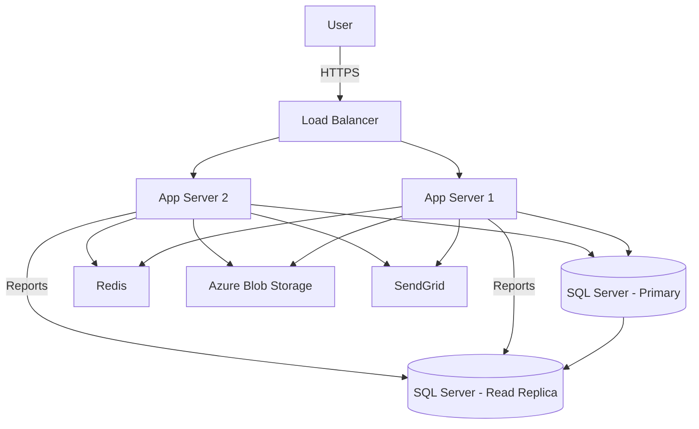

## Context
Internal SaaS platform for HR management. ~500 concurrent users. Must comply with LGPD (Brazilian data protection law). Budget is limited — single cloud (Azure).

## Architecture (Mermaid)

## Notes
- Auth is username/password only, stored in SQL Server (bcrypt hashed)
- No API rate limiting implemented yet
- All environments (dev/staging/prod) share the same Azure subscription
- Database backups run nightly, retention = 7 days
- No WAF in front of the load balancer
- Logs are stored in Azure Monitor but no alerts configured
